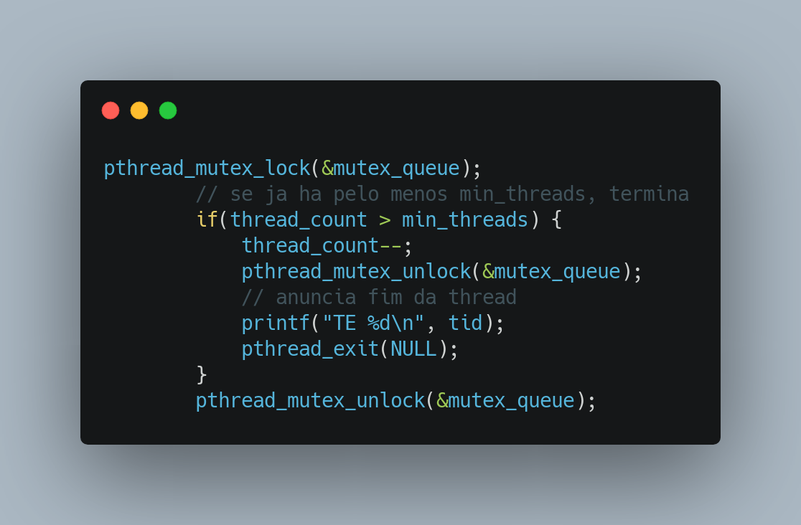

# Trabalho Prático 1: FSPD
Lucas Fonseca Mundim - 2015042134\
2022/1

# Introdução

Este trabalho prático de FSPD tem como objetivo exercitar conhecimentos de pthreads, mais especificamente do uso de `pthread_cond_t`, `pthread_t` e `pthread_mutex_t` para criar uma abstração de ThreadPool, exercitando o conteúdo visto até agora na disciplina de forma prática.

# Detalhes da implementação

Para a execução do trabalho prático, foi necessário implementar uma `ThreadPool` e uma estrutura para manter as tarefas que seriam recebidas. As tarefas seriam executadas no modelo `FIFO`, portanto uma estrutura do tipo `Queue` era a ideal para a utilização. Foi definida uma utilização minimalista de ambas as estruturas tendo em vista que o escopo do projeto é bem reduzido. Abaixo é possível ver alguns trechos importantes:

* `ThreadPool`:

Como nunca existirão mais do que `max_threads` threads na `ThreadPool`, o tamanho máximo da coleção de threads foi definido como este valor, com `min_threads` threads já inicialiadas para evitar overhead de inicialização. A `ThreadPool` sempre terá pelo menos essa quantidade de threads esperando tarefas.

* `Queue`:

Para a implementação da fila, foi definida uma estrutura extremamente simples utilizando `Array` para evitar a complicação de envolver mais `struct`s no projeto. O mais importante era que as funções `push()` e `pop()` precisavam ser **thread safe**. Para isso foi utilizado um `pthread_mutex_t` nomeado `mutex_queue`, impedindo acesso concorrente às seções críticas desses métodos. Também é importante chamar a atenção para o primeiro uso de `pthread_cond_t`, presente no método `push()`. Ao adicionar uma nova tarefa na fila, `pthread_cond_signal()` é executado para sinalizar à uma thread em espera.

Para a inicialização de threads, foi construído o método `start_thread()` que cuida de todo o processo necessário para o ciclo de vida daquela thread:
* Definição de **thread ID**:

Ao ser iniciada, a thread incrementa um contador **thread safe** para definir seu ID e anuncia sua criação.
* Início do loop de tarefas e espera pela primeira tarefa:

Enquanto não houverem tarefas enfileiradas, a thread fica em espera com `pthread_cond_wait()`. Isso evita o consumo de CPU enquanto estiver _idle_.
* Recuperação da definição de tarefa:

Simplesmente é chamado o método `pop()` para recuperar o primeiro item da fila. Note que a falta de `lock` no método `pop()` é devido à sua existência no passo anterior.
* Verificação de **EOW**:

É feita a verificação de **EOW** na tarefa recuperada. Se for **EOW**, a thread anuncia seu encerramento e o faz. EOW foi definido conforme sugerido:

* Execução da tarefa:

Se a tarefa for uma tarefa válida, ela é executada.
* Encerramento da thread caso necessário:

Caso existam, além da thread corrente, pelo menos `min_threads`, a thread atual anuncia seu encerramento e o faz.

A criação de threads extras (entre `min_threads` e `max_threads`) se faz no ato da recepção de uma nova tarefa: caso seja criada uma nova tarefa e a quantidade de threads em espera é menor que o máximo, uma nova thread é criada.

Ao final, ao receber um `EOF` (`-1` no lugar de `pid`), a fila é preenchida com `max_threads` `EOW` que seguem por encerrar todas as threads restantes.

# Conclusão

Algumas decisões de projeto com o fim de simplificar a implementação foram tomadas com o escopo do projeto, o que por fim foi uma boa decisão, deixando a implementação mais simples de ser depurada utilizando `lldb` e testada. A aplicação rudimentar de threads utilizando `pthread.h` é importante para entendermos o que outras bibliotecas mais robustas e modernas fazem "por baixo dos panos" e, de fato, compreender o que é paralelismo e o por quê das leis de Amdahl e Gustafsson.

---
